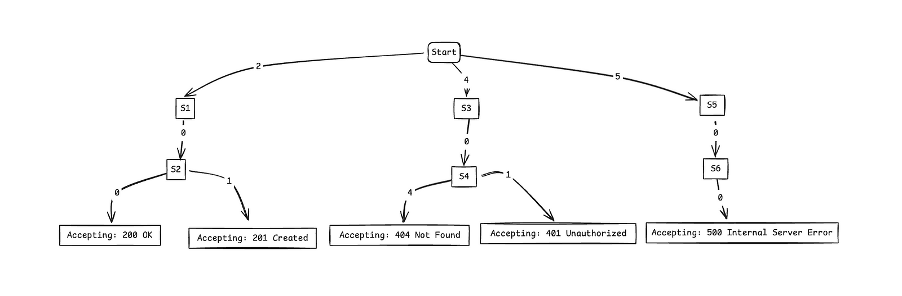

# FSM-Constrained-Generation
Constraining LLM Outputs with Finite State Machines

We can combine large language models with a simple Finite State Machine (FSM) to enforce domain-specific constraints in text generation. By focusing on HTTP status codes as an example, we demonstrate a practical way to limit a model’s output to only a few valid sequences (e.g., “404 Not Found”), showcasing how traditional symbolic methods (FSMs) can bolster neural language models for precise outcomes.

Rather than relying on pure probability, we integrate a small piece of custom logic into the generation loop. This logic checks the model’s proposed tokens against a transition table linked to valid sequences. If a token is not part of a valid path toward one of the acceptable codes, it is disallowed. The result is a powerful yet simple technique for shaping AI-generated text to meet specific requirements—be it structured responses, sensitive data redaction, or compliance with industry standards.

